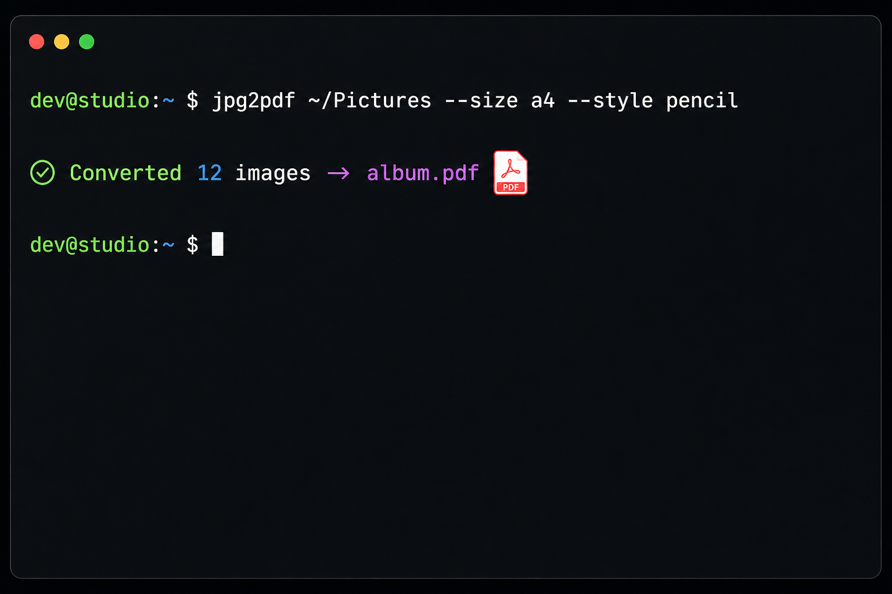

<div align="center">

# 📄 img-pdf

**Turn a folder of images into one beautiful PDF — in a single command.**

Cross-platform CLI · Quality-preserving · Windows right-click integration · Pencil-sketch mode for faint text

[](https://github.com/alimtvnetwork/img-pdf/releases)
[](https://github.com/alimtvnetwork/img-pdf/releases)
[](#license)

<br/>



</div>

---

## ✨ What it does

`jpg2pdf` walks a folder of images and stitches them into **one** PDF — preserving
quality, respecting orientation, and handling page sizing for you. No more
opening 30 images one-by-one, "Print to PDF", merging, repeat.

| Feature | Why it matters |
| --- | --- |
| 🖼️  **Quality-preserving** | Embeds the original JPEG bytes when possible — no recompression artifacts. |
| 📐 **Smart sizing** | `a4`, `letter`, `legal` — with `fit cover/contain` and `--orientation`. |
| ✏️  **Pencil mode** | Faint pencil-on-paper styling with **subtle / normal / extra-visible** depth. |
| 🪟 **Windows context-menu** | Right-click any folder → *"Combine into PDF"*. One terminal, all files. |
| 🍎 **macOS / Linux** | Single static binary, ad-hoc signed, drops into `~/.local/bin`. |
| 🔁 **Recursive** | `--recursive` walks subfolders in natural sort order. |

---

## 🚀 Install — one line

### Windows (PowerShell)

```powershell
irm https://raw.githubusercontent.com/alimtvnetwork/img-pdf/main/install.ps1 | iex
```

Drops `jpg2pdf.exe` into `%USERPROFILE%\Tools\bin`, adds it to your **User PATH**,
and registers the Explorer right-click entries. Open a new terminal afterwards.

### macOS / Linux

```bash
curl -fsSL https://raw.githubusercontent.com/alimtvnetwork/img-pdf/main/install.sh | sh
```

Drops `jpg2pdf` into `~/.local/bin` (override with `JPG2PDF_PREFIX=$HOME/bin`).

> Pin a version with `JPG2PDF_VERSION=v0.8.0`, or skip context-menu registration
> with `JPG2PDF_NO_CONTEXT_MENU=1`.

---

## 🎯 Use it

```bash
# The basics
jpg2pdf ~/Pictures --size a4
jpg2pdf .         --size letter --fit cover --out album.pdf
jpg2pdf .         --size legal  --orientation landscape --recursive

# Pencil-on-paper styling for scanned notes / faint handwriting
jpg2pdf ./notes --size a4 --style pencil
jpg2pdf ./notes --size a4 --style pencil --ask-strength   # pick subtle/normal/extra-visible
```

Supported inputs: `.jpg .jpeg .png .webp .bmp .tif .tiff` (sorted naturally).

### ✏️ Pencil strength — three depths

| Mode | When to use |
| --- | --- |
| `subtle`         | Already-readable scans you just want to soften. |
| `normal`         | The default — balanced ink + paper grain. |
| `extra-visible`  | Faint / low-contrast handwriting that needs pop. |

Pick interactively with `--ask-strength`, or pass `--pencil-opacity` /
`--pencil-ink-darken` for full manual control.

---

## 🪟 Windows right-click

After install, right-click works two ways — both route through a **single terminal**:

- **On a folder** → *Combine images into PDF* / *Combine images into PDF (pencil)*
- **On selected images** → same actions, but only the highlighted files are queued

No more 30 terminals popping up for 30 selected files. The launcher batches
everything into one conversion call.

---

## 🛠️ Build from source

```bash
pip install -r tools/jpg2pdf/requirements.txt
python tools/jpg2pdf/src/jpg2pdf.py ./photos --size a4
```

---

## 📦 Repo layout

```text
img-pdf/
├── install.ps1                          # one-liner Windows installer
├── install.sh                           # one-liner macOS / Linux installer
├── run.ps1 / uninstall.ps1              # local runner + uninstaller
└── tools/jpg2pdf/
    ├── src/jpg2pdf.py                   # the CLI
    ├── scripts/register-context-menu.ps1
    ├── spec/SPEC.md                     # full spec
    ├── docs/hero.png
    ├── requirements.txt
    └── VERSION
```

---

## 🚢 Cutting a release

Tag & push — GitHub Actions builds binaries for Windows / Linux / macOS
(x64 + Apple Silicon) and publishes a Release with `SHA256SUMS.txt`:

```bash
git tag v0.8.0 && git push origin v0.8.0
```

Released artifacts: `jpg2pdf-windows-x64.exe`, `jpg2pdf-linux-x64`,
`jpg2pdf-linux-arm64`, `jpg2pdf-macos-x64`, `jpg2pdf-macos-arm64`.

---

## License

MIT © [alimtvnetwork](https://github.com/alimtvnetwork)
